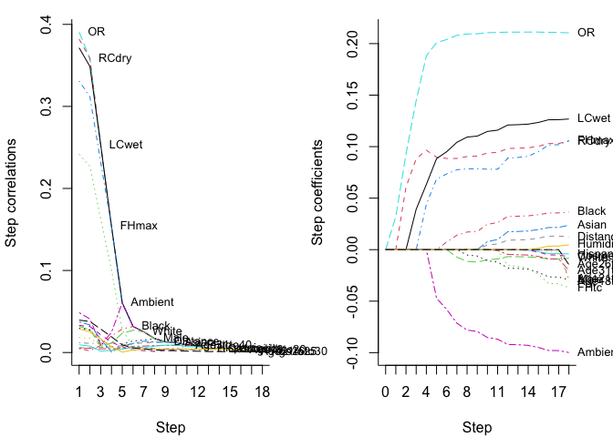
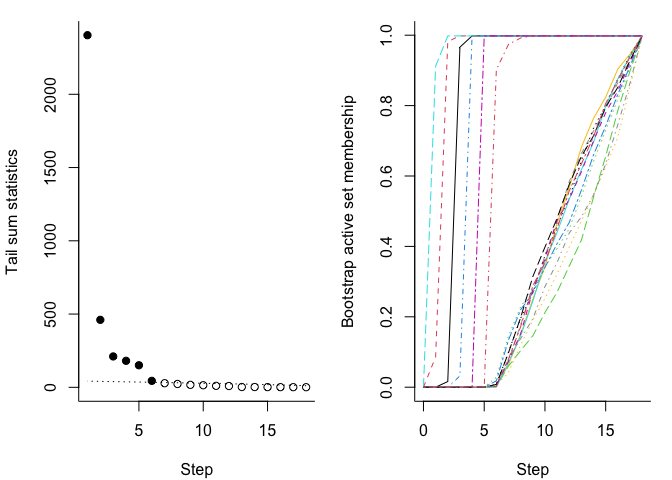

# The larinf package

Perform inference on the least angle regression (LAR) path.

<!-- This is an R package which accompanies the paper: -->
<!-- Gregory, K. and Nordman, D. (2025+). Least angle regression inference. *In progress* -->
<!-- Find the paper on the page https://imstat.org/journals-and-publications/annals-of-statistics/annals-of-statistics-future-papers/ -->

Install with the R commands:

    install.packages("devtools")
    devtools::install_github("gregorkb/larinf")

See the package documentation for details.

# Illustration on example data set

Compute and plot the least angle regression path for the response vector
and design matrix in the data set `facetemp`, which is included in the
`larinf` package:

    data(facetemp)
    X <- facetemp$X
    y <- facetemp$y

    lar_out <- lar(X,y)
    plot(lar_out)

Obtain bootstrap confidence intervals for the step correlations and the
step coefficients up to the number of estimated steps:

    larinf_out <- larinf(X,y)
    plot(larinf_out)

    print(larinf_out)

    ## Estimated number of steps in population path: 6
    ## 
    ## Step correlations in order of entrance:
    ## 
    ##                 Sk  Chi^2    Ck  2.5% 97.5%
    ## OR        2403.291 42.097 0.391 0.372 0.408
    ## RCdry      460.676 40.578 0.358 0.327 0.396
    ## LCwet      210.710 39.044 0.253 0.176 0.378
    ## FHmax      180.969 37.493 0.154 0.103 0.208
    ## Ambient    150.449 35.922 0.061 0.049 0.071
    ## Black       44.194 34.331 0.032 0.015 0.044
    ## White       27.992 32.716 0.025 0.000 0.061
    ## Male        22.874 31.075 0.017 0.002 0.033
    ## Distance    16.910 29.403 0.013 0.000 0.028
    ## Asian       14.217 27.697 0.012 0.003 0.022
    ## Age31to40   10.015 25.949 0.009 0.000 0.020
    ## FHtc         8.789 24.151 0.008 0.003 0.012
    ## Hispanic     2.035 22.292 0.005 0.000 0.023
    ## Cosmetics    1.924 20.355 0.005 0.000 0.012
    ## Humidity     1.425 18.313 0.004 0.000 0.017
    ## Age18to20    1.154 16.119 0.003 0.000 0.016
    ## Age21to25    1.062 13.677 0.001 0.000 0.004
    ## Age26to30    0.799 10.699 0.001 0.000 0.002
    ## 
    ## 
    ## Step coefficients at step 6:
    ## 
    ##              b   2.5%  97.5%
    ## OR       0.216  0.191  0.242
    ## RCdry    0.084  0.045  0.119
    ## LCwet    0.121  0.085  0.161
    ## FHmax    0.092  0.066  0.118
    ## Ambient -0.100 -0.117 -0.081
    ## Black    0.036  0.017  0.072

Produce diagnostic plots:

    plot(larinf_out, which = 2)

