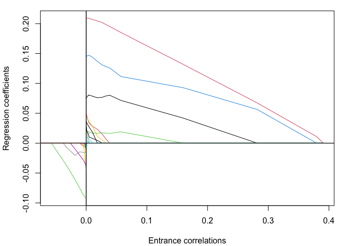
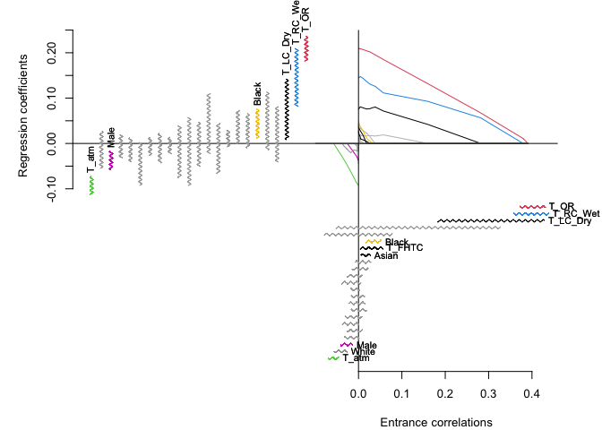

Install with the R commands:


``` r
install.packages("devtools")
devtools::install_github("gregorkb/larinf")
```

See the package documentation for details. 

# Illustration on example data set

Compute and plot the least angle regression path for the response vector and design matrix in the data set `facetemp`, which is included in the `larinf` package:


``` r
data(facetemp)
X <- facetemp$X
y <- facetemp$y

lar_out <- lar(X,y)
plot(lar_out)
```

<!-- -->


Obtain bootstrap confidence intervals for the entrance correlations and make a plot comparing inference on the least angle regression entrance correlations to classical inference on the regression coefficients:

``` r
larinf_out <- larinf(X,y)
plot(larinf_out,omaadd=c(0,0,1,1))
```

<!-- -->


Print the estimated entrance correlations with 95\% confidence intervals:

``` r
larinf_out
```

```
## In order of entrance:
## 
##           Entrance correlation   2.5%  97.5%
## T_OR                     0.391  0.373  0.430
## T_RC_Wet                 0.380  0.357  0.439
## T_LC_Dry                 0.282  0.182  0.429
## T_RC_Dry                 0.160 -0.052  0.327
## T_atm                   -0.057 -0.069 -0.046
## T_LC_Wet                 0.038 -0.079  0.079
## White                   -0.038 -0.056 -0.026
## Black                    0.033  0.016  0.053
## T_FHTC                   0.026  0.004  0.056
## Male                    -0.026 -0.041 -0.013
## Asian                    0.018  0.007  0.028
## Hisp                    -0.011 -0.033  0.002
## Distance                 0.010 -0.007  0.028
## Age31_40                -0.009 -0.027  0.009
## Age21_25                 0.007 -0.014  0.022
## T_FHLC                  -0.005 -0.037  0.001
## Cosmetics               -0.005 -0.031  0.007
## T_FHBC                   0.004 -0.026  0.008
## Age26_30                -0.003 -0.017  0.019
## Humidity                -0.003 -0.023  0.015
## Age18_20                -0.002 -0.017  0.014
## T_FHCC                  -0.001 -0.018  0.004
## T_FHRC                   0.000 -0.039  0.005
```
